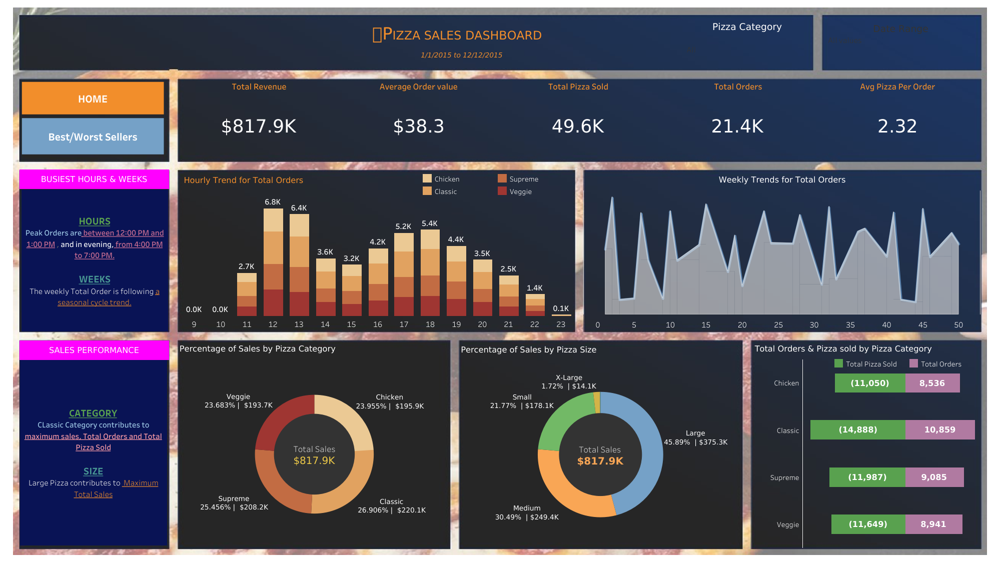
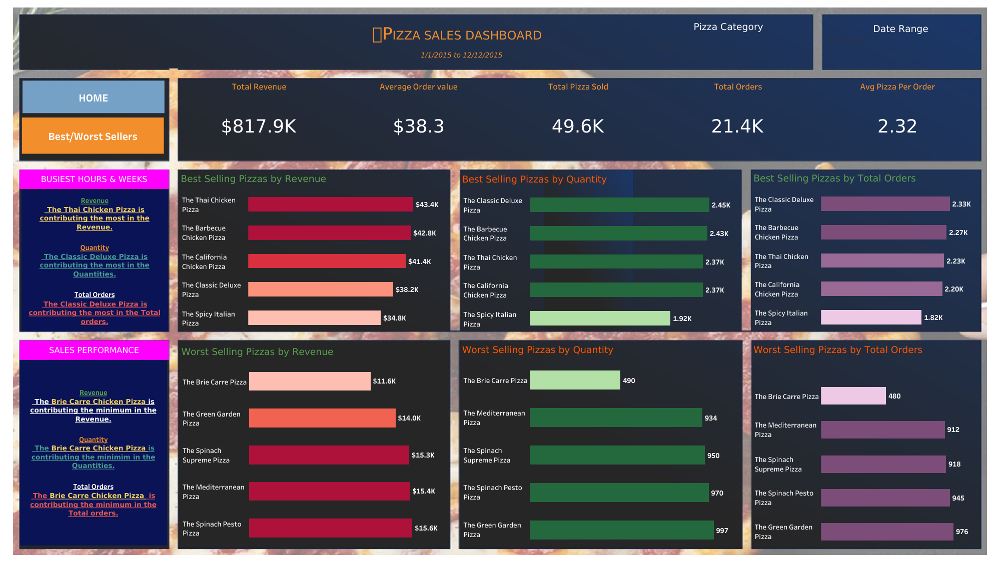

# 🍕 Pizza Sales Dashboard
## Overview
This project is a comprehensive analysis and visualization of pizza sales data collected between January 1, 2015, and December 12, 2015.

The interactive dashboard provides insights into total revenue, top-selling pizzas, customer buying patterns, and sales trends across different pizza categories and sizes.

## Quick Preview

| Home Tab | Best/Worst Sellers Tab |
| :------: | :--------------------: |
|  |  |

## 🌐 View Dashboard Online

👉 [**View the Interactive Tableau Dashboard**](https://public.tableau.com/app/profile/sameera.tanveer/viz/PizzaSalesDashboard-Project2ProjectBasedLearning/BestWorstSeller)

## Domain Knowledge
Pizza businesses operate in a highly competitive food market where understanding customer preferences, peak business hours, and product performance is crucial for maximizing revenue and operational efficiency.

Analyzing sales data helps businesses:

- Optimize **menu offerings** (promoting best-sellers, improving low performers)
- Adjust **staffing and inventory** based on peak hours
- Create targeted **marketing promotions**
- Increase **average order value and customer satisfaction**

> **Fun Fact:**  
> The global pizza market size was valued at **over $145 billion in 2022**, with the U.S. holding a major share.  
> Understanding sales behavior even at a small scale can significantly impact profitability!

---

## 📅 Dataset Description
- **Time Period**: 1st Jan 2015 – 12th Dec 2015
- **Key Variables**:
  - Order Date and Time
  - Pizza Category (Chicken, Supreme, Veggie, Classic)
  - Pizza Size (Small, Medium, Large, X-Large)
  - Quantity Ordered
  - Order Revenue

The dataset captures **hourly, weekly, and category-level** sales information.

---

## 📈 Dashboard Insights

### 🔥 General Metrics
- **Total Revenue**: $817.9K
- **Average Order Value**: $38.3
- **Total Pizzas Sold**: 49.6K
- **Total Orders**: 21.4K
- **Average Pizzas per Order**: 2.32

### 🕒 Busiest Hours & Weeks
- **Peak Order Times**:
  - **Lunch**: Between **12:00 PM and 1:00 PM**
  - **Evening**: Between **4:00 PM and 7:00 PM**
- **Seasonality**:
  - Weekly total orders follow a **cyclical trend**, indicating **seasonal demand variations**.

### 🍕 Pizza Sales Performance
- **By Category**:
  - **Classic** category contributed the highest to both **total sales and total orders**.
- **By Size**:
  - **Large pizzas** generated the maximum revenue share (45.89%).

### 🏆 Best & Worst Sellers
- **Top-Selling Pizza by Revenue**:  
  - **The Thai Chicken Pizza** ($43.4K)
- **Top-Selling Pizza by Quantity & Orders**:  
  - **The Classic Deluxe Pizza**
- **Least-Selling Pizza**:  
  - **The Brie Carre Pizza** (only $11.6K revenue and 480 orders)

---

## How to Use the Dashboard
- Navigate between tabs: **Home** and **Best/Worst Sellers**.
- Explore:
  - **Hourly trends** to optimize staffing and promotions.
  - **Top & Bottom performers** for menu engineering.
  - **Sales breakdown** by category and pizza size to tailor marketing efforts.

> *If you are running this dashboard locally, you can open it using  **Tableau** (as applicable).*

---

## Conclusion
This dashboard provides actionable insights to drive **business growth** for a pizza company by identifying:

- What sells best and when.
- Which products underperform and need reevaluation.
- Optimal strategies to maximize sales and operational efficiency.

---

